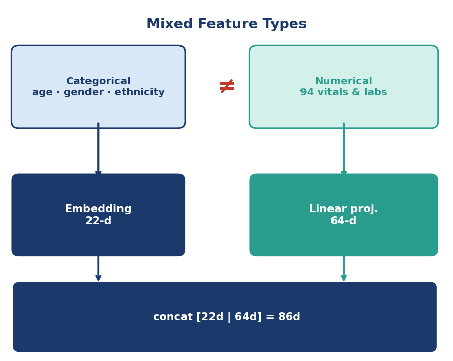
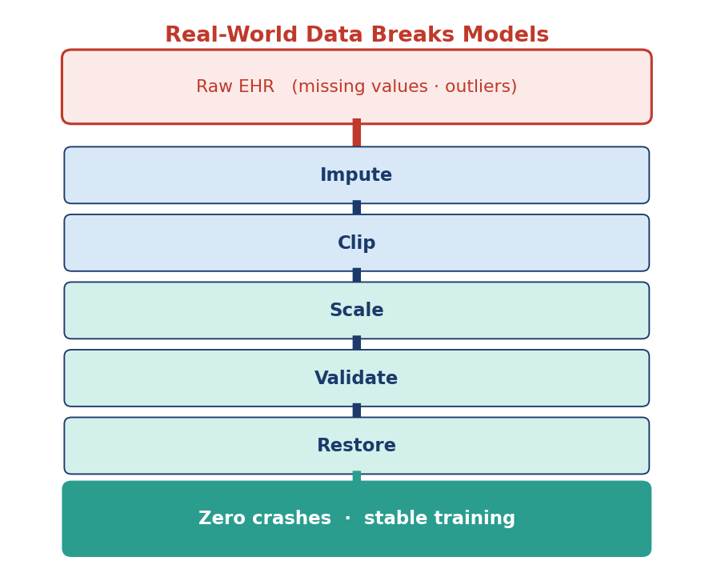
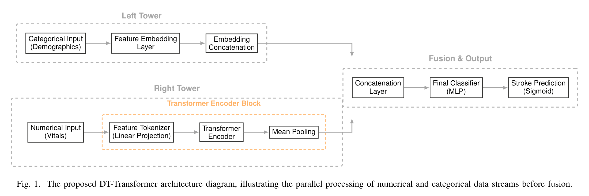
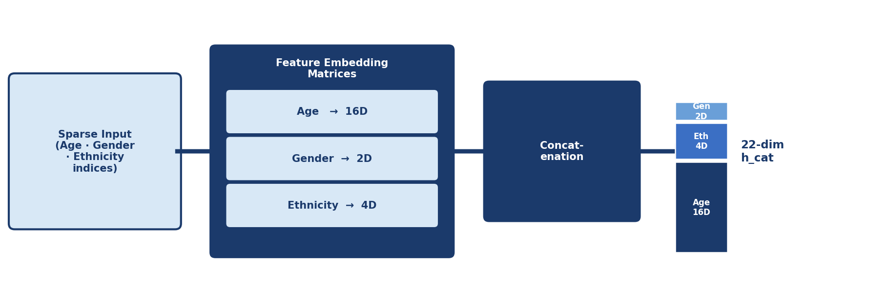
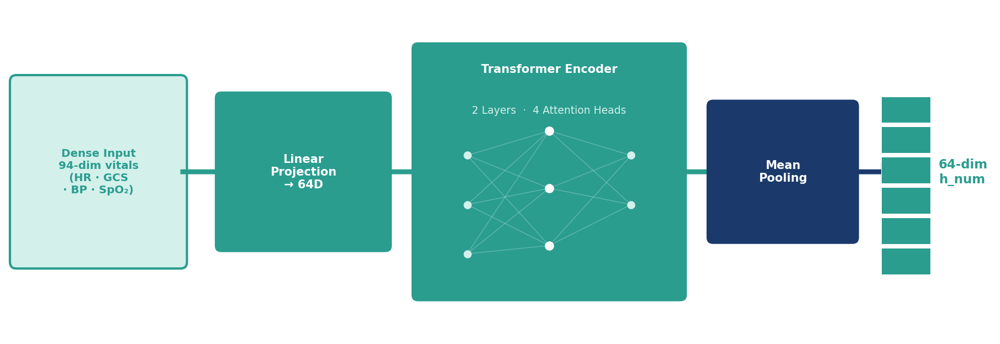
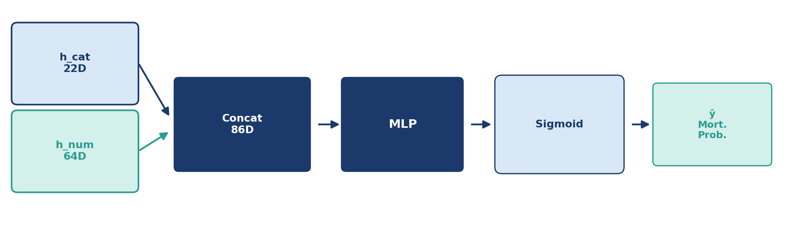
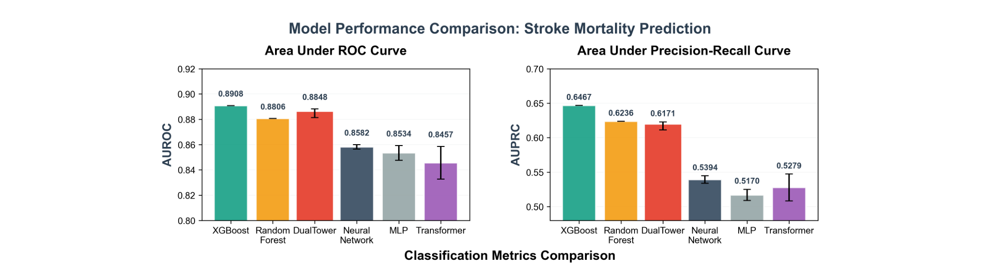
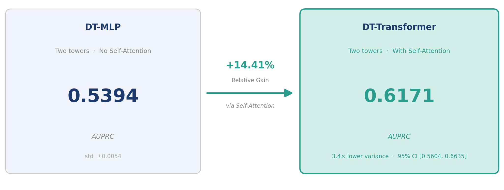
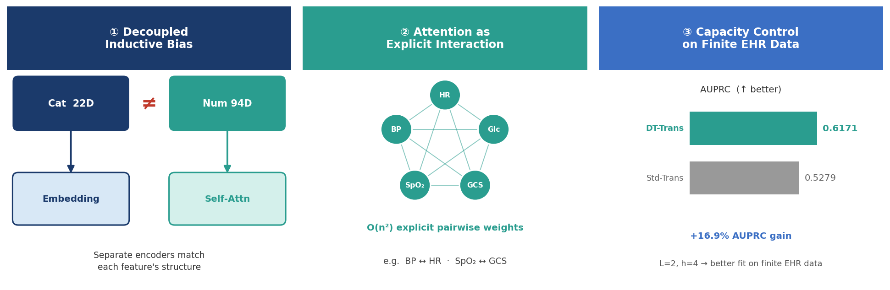
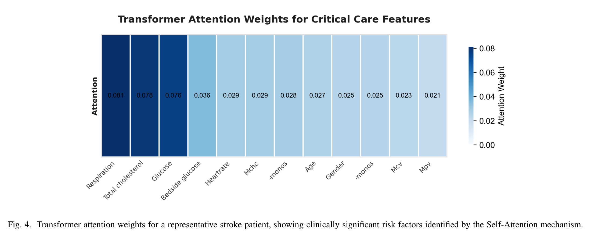

<!-- _class: cover -->
<!-- _paginate: false -->
<!-- _footer: "" -->

# Deep Learning for Stroke Mortality Prediction in eICU: A Dual-Tower Transformer Framework

**Zhengrong Jia\*  ；  Kwong-Cheong Wong\***

*Presenter:* Zhengrong Jia

*From:* Asia AI Education and Future Technology Association, Hong Kong SAR, China

*Research Area:* Deep Learning · Clinical EHR · Stroke Mortality Prediction

*Email:* zhengrong.jia.academic@gmail.com

**Paper CI5896  ·  CCAI 2026  ·  May 22–24, Nanjing**

---

# What We Will Cover

1. Motivation — why ICU mortality prediction is hard
2. Dataset & two core challenges
3. DT-Transformer: dual-tower architecture
4. Experiments — results & ablation
5. Theoretical implications (§V.B): why it works
6. Interpretability — what the model attends to
7. Conclusion & future directions

> Paper CI5896  ·  DT-Transformer  ·  eICU  ·  Stroke Mortality Prediction

---

# Why Standard Deep Learning Fails on Mixed Clinical Data

  

    15–20%
    in-hospital mortality
    among stroke ICU patients · Feigin et al., 2021
  

  

    
<strong>Why Standard DL Still Fails Here</strong>

    <ul>
      <li>Tabular EHR mixes categorical + continuous features → architectures without the right inductive bias underfit</li>
      <li>Clinical data: outliers, missing values, NaNs → monolithic Transformers crash or converge poorly <em>(Std Transformer AUPRC 0.5279 ± 0.0195)</em></li>
      <li>eICU: 97 features, 14% mortality, multi-center noise</li>
    </ul>
  

> The challenge is not data volume — it is **architectural mismatch** between standard DL and the structure of clinical tabular data.

---

# The eICU Database

*Multi-center · freely available · Pollard et al., 2018*

  

    97
    features
    total input dimension
  

  

    3 + 94
    cat + num
    age/gender/ethnicity + vitals & labs
  

  

    14%
    mortality rate
    heavily class-imbalanced
  

  

    AUPRC
    not AUROC
    right metric for imbalance
  

> **14% mortality** → AUPRC is the right metric. Our **0.6171** is far above random-classifier level.

---

# Two Problems We Had to Solve

  

    
  

  

    
  

> Heterogeneous feature types demand **separate encoders**. Raw EHR data demands an **online safety layer**.

---

# Our Model: The DT-Transformer

*C1: Dual-Tower Encoder  ·  C2: Adaptive Safeguard  ·  C3: Optuna HPO*

> **Dual-Tower encoding** + **Adaptive Safeguard** + **Optuna HPO** — three contributions, one differentiable pipeline.

---

# Left Tower: Categorical Embeddings

> High-dimensional sparse indices → dense **22-d vector h_cat**. Each feature gets its own learned embedding space.

---

# Right Tower: Numerical Transformer

> **Self-Attention** explicitly computes pairwise interactions across all 94 physiological features — something MLPs only approximate.

---

# Feature Fusion and Prediction

> The outputs of both towers are concatenated into **h_joint ∈ ℝ⁸⁶** — bridging static demographic features and dynamic vital signs.

---

# DT-Transformer Is Now Competitive With XGBoost

  

    0.6171
    AUPRC
    ±0.0058 · 5 seeds
  

  

    0.8848
    AUROC
    ±0.0034 · 5 seeds
  

  

    +14.4%
    vs DT-MLP
    XGBoost: 0.6467
  

> XGBoost retains a marginal AUPRC lead (0.6467) — our deep learning model **closes the gap** with full differentiability.

---

# Self-Attention Is the Key: +14.41% Relative AUPRC Gain

> Replacing the Transformer encoder with fully connected layers drops AUPRC by **14.41%** — the gain is driven by **self-attention** modeling global feature interactions.

---

# Why the Dual Tower Wins: Three Design Principles (§V.B)

> Beyond empirical gains: **three design principles** for applying deep learning to heterogeneous clinical tabular data.

---

# The Model Focuses on What Clinicians Care About

*Top 5 features by attention weight*

  

    Respiration
    0.081
  

  

    Total Cholesterol
    0.078
  

  

    Glucose
    0.076
  

  

    Bedside Glucose
    0.036
  

  

    Heart Rate
    0.029
  

> The model **autonomously** prioritizes clinically significant risk factors, improving interpretability compared to black-box baselines.

---

# What We Showed and Where We Go Next

  

    
What we showed

    

      

        Architecture Matters
        Decoupled towers + self-attention: AUPRC <strong>0.5394 → 0.6171</strong> with 5-seed consistency
      

      

        Engineering for Robustness
        Adaptive Runtime Safeguard: <strong>zero-crash inference</strong> on multi-center EHR data
      

      

        Fair Comparison
        Optuna HPO: attention-based deep learning <strong>competes with XGBoost</strong> when properly tuned
      

    

  

  

    
What comes next

    

      

        Validate on MIMIC-IV
        Test generalization across hospital systems
      

      

        Fuse clinical notes with LLMs
        Go beyond structured EHR features
      

      

        Shadow-mode clinical trial
        Run alongside real ICU decision-making
      

    

  

> A fully differentiable alternative to gradient boosting — extensible to **multimodal integration** with unstructured clinical notes.

---

<!-- _paginate: false -->
<!-- _footer: "" -->

# Thank You

## Questions welcome

Zhengrong Jia  ·  zhengrong.jia.academic@gmail.com

Paper **CI5896**  ·  CCAI 2026  ·  May 22–24, Nanjing
